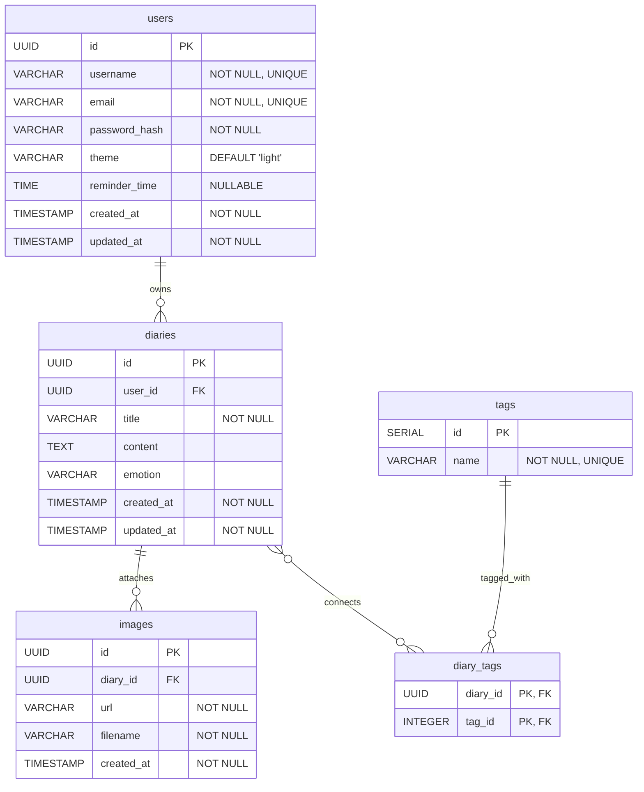

# **データモデル定義書 - My Diary App**

## **1. 概要**

本ドキュメントは「My Diary App」が使用するデータベースのテーブル構造とリレーションシップを定義します。

## **2. ER図**

**リレーションシップの説明:**
* 一人のユーザー(`users`)は複数の日記(`diaries`)を持つことができます。
* 一つの日記(`diaries`)は複数のタグ(`tags`)を持つことができ、一つのタグも複数の日記に付けられます（多対多）。
* 一つの日記(`diaries`)には複数の画像(`images`)を添付できます。

## **3. テーブル定義**

### **users**

ユーザー情報を管理します。

| カラム名 | データ型 | 制約 | 説明 |
|:---------|:---------|:-----|:-----|
| id | UUID | PRIMARY KEY | ユーザーの一意なID |
| username | VARCHAR(50) | NOT NULL, UNIQUE | 表示名 |
| email | VARCHAR(255) | NOT NULL, UNIQUE | メールアドレス |
| password_hash | VARCHAR(255) | NOT NULL | ハッシュ化されたパスワード |
| theme | VARCHAR(10) | DEFAULT 'light' | 'light' or 'dark' |
| reminder_time | TIME | NULLABLE | リマインダー通知時刻 |
| created_at | TIMESTAMP | NOT NULL, DEFAULT CURRENT_TIMESTAMP | 作成日時 |
| updated_at | TIMESTAMP | NOT NULL, DEFAULT CURRENT_TIMESTAMP | 更新日時 |

### **diaries**

日記の基本情報を格納します。

| カラム名 | データ型 | 制約 | 説明 |
|:---------|:---------|:-----|:-----|
| id | UUID | PRIMARY KEY | 日記の一意なID |
| user_id | UUID | FOREIGN KEY (users.id) | この日記を所有するユーザーID |
| title | VARCHAR(255) | NOT NULL | 日記のタイトル |
| content | TEXT |  | 日記の本文 |
| emotion | VARCHAR(20) |  | 感情アイコンの識別子 ('happy', 'sad', etc.) |
| created_at | TIMESTAMP | NOT NULL, DEFAULT CURRENT_TIMESTAMP | 作成日時 |
| updated_at | TIMESTAMP | NOT NULL, DEFAULT CURRENT_TIMESTAMP | 更新日時 |

### **images**

日記に添付された画像を管理します。

| カラム名 | データ型 | 制約 | 説明 |
|:---------|:---------|:-----|:-----|
| id | UUID | PRIMARY KEY | 画像の一意なID |
| diary_id | UUID | FOREIGN KEY (diaries.id) | この画像が属する日記ID |
| url | VARCHAR(2048) | NOT NULL | 画像が保存されているURL (CDNなど) |
| filename | VARCHAR(255) | NOT NULL | 元のファイル名 |
| created_at | TIMESTAMP | NOT NULL, DEFAULT CURRENT_TIMESTAMP | 作成日時 |

### **tags**

タグ情報を一意に管理します。

| カラム名 | データ型 | 制約 | 説明 |
|:---------|:---------|:-----|:-----|
| id | SERIAL | PRIMARY KEY | タグの一意なID |
| name | VARCHAR(50) | NOT NULL, UNIQUE | タグ名 (例: "旅行", "仕事") |

### **diary_tags**

日記とタグの多対多の関連を管理する中間テーブルです。

| カラム名 | データ型 | 制約 | 説明 |
|:---------|:---------|:-----|:-----|
| diary_id | UUID | PRIMARY KEY, FOREIGN KEY (diaries.id) | 関連する日記のID |
| tag_id | INTEGER | PRIMARY KEY, FOREIGN KEY (tags.id) | 関連するタグのID |